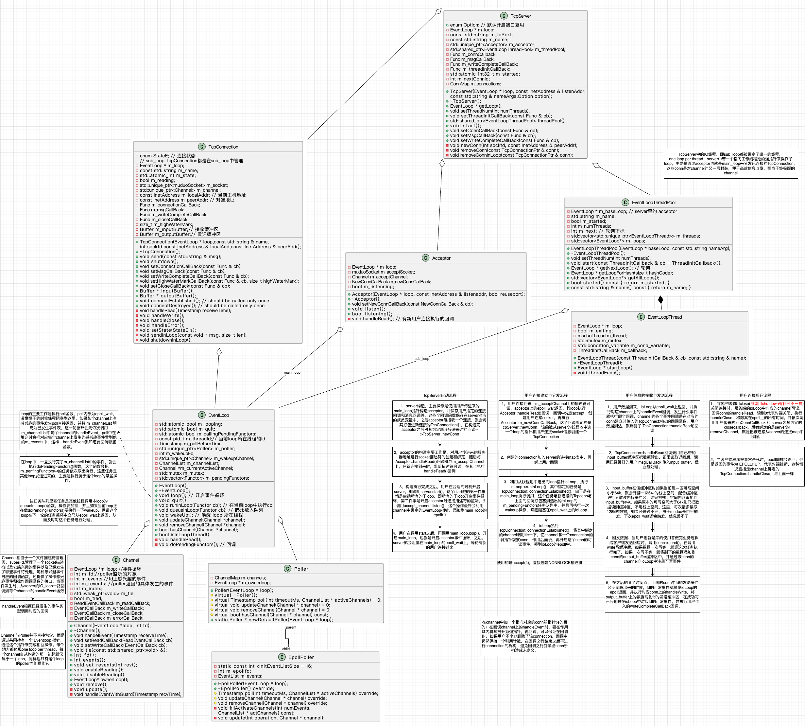

# 简要说明

与原版muduo库相比：

    移除了boost库，使用c++11标准库代替。

    只用了epoll实现主要功能。

    线程，锁等使用了C++11标准库提供的组件，代码更精简。

## 1. 编译&&安装

    硬性要求：linux环境，C++编译器支持C++11标准。
    测试环境：
        ubuntu24.04,
        g++ 11.4.0,
        GNU Make 4.3,
        cmake version 3.28.3
    
    编译&&安装：
        git clone https://github.com/SuycxZMZ/tiny-muduo.git
        cd tiny-muduo
        mkdir build
        cd build
        cmake ..
        make 
        sudo make install

    测试回显服务器：
        cd test
        ./echoserver
        ## 正常安装的话已经开始打印信息了，并等待客户端连接

    测试回显客户端：
        telnet 127.0.0.1 8000
        ## 输入任意字符，回车后，会打印出客户端输入的字符

## 2. 主要组件说明

[1. 主要组件说明](docs/basicClass.md)

[2. 连接流程说明](docs/basicConnectModel.md)

[3. 读写流程说明](docs/basicReadWriteModel.md)

[4. 关闭流程说明](docs/basicCloseModel.md)

[5. one loop per thread 模型](docs/basicOneLoopPerThreadModel.md)

[6. 日志模块说明](docs/basiclog.md)

### **资料**

- [sylar和muduo的一些总结](https://zakuv5r1g02.feishu.cn/wiki/NTbawzte0iyYnrkYfyMc8PmwnlP?from=from_copylink)，批判性的看就行，这是我秋招刚开始时写的，后面没有再改
- 我画的一张比较简陋的图

## 3. 压力测试 WebBench

    webbench -c 500 -t 30 http://127.0.0.1:8080/
    环境：ubuntu24.04, 4核8G, 6代i5

    ------------ 本机测试 127.0.0.1 -------------
    ---- 关闭所有日志 ----
    qps:30000左右
    ---- 控制台日志 ----
    qps:缩5倍以上
    ---- 异步日志 ----
    qps:损失不到1/4

    ------------ 公网测试 -------------
    qps:2000左右，主要瓶颈在网络发包上，完全吃不满cpu

    ------------ 局域网 -------------

新的测试，环境：ubuntu24子系统，8代i7，24G内存，不限制子系统性能，仍然webbench本机测试

- 比较诡异的点，开8个工作线程之后QPS直接砍半，还没找到原因，之后可以拉局域网测一下，webbench也在本机不好分析

  | tinymuduo           | 4线程                      | 8线程                     |
  |:---------------:|:--------------------------:|:-------------------------:|
  | 连接数：500     | QPS: 30000    faild: 0  | QPS: 13000    faild: 0 |
  | 连接数：1000    | QPS: 30000    faild: 0  | QPS: 13000    faild: 0 |
  | 连接数：10000   | QPS: 25000    faild: 2  | QPS: 12000    faild: 908(all: 37w) |
  | 连接数：15000   | QPS: 12300    faild: 10w(all: 37w) | QPS: 8700     faild: 0(all: 26w)  |
  | 连接数：20000   | QPS: 37000(没意义了)   faild: 97w(all: 100w) | QPS: 37000(没意义了)   faild: 978247(all: 100w) |

**参考 && 致谢 ：**

https://github.com/chenshuo/muduo

https://blog.csdn.net/T_Solotov/article/details/124044175

https://zhuanlan.zhihu.com/p/636581210

https://github.com/Shangyizhou/A-Tiny-Network-Library

https://www.cnblogs.com/tuilk/p/16793625.html