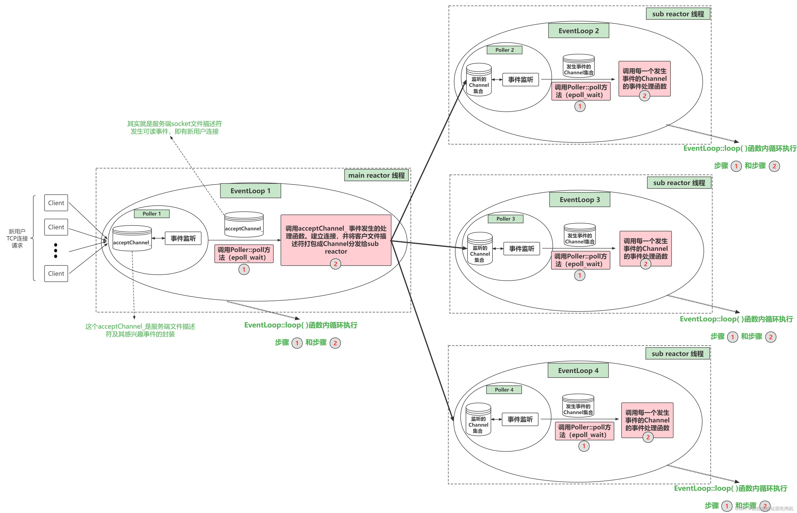

### 基本组件
    one loop per thread, 每个loop里包含一个poller和一组channel,二者没有耦合性，但是都持有其所在loop的指针 m_loop，通过这个指针相互关联。
#### 1. Channel
    Channel类相当于一个文件描述符的保姆，封装了一个 [fd] 和这个 [fd感兴趣事件] 以及事件监听器监听到 [该fd实际发生的事件]。同时Channel类还提供了设置该fd的感兴趣事件，以及将该fd及其感兴趣事件注册到事件监听器或从事件监听器上移除，以及保存了该fd的每种事件对应的处理函数。

 - m_fd : Channel对象照看的文件描述符 
 - m_events : m_fd上感兴趣的事件类型集合 
 - int m_revents : m_fd上发生的事件类型集合，当事件监听器监听到一个fd发生了什么事件，通过Channel::set_revents()函数来设置revents值。
 - EventLoop* loop：m_fd从属的EventLoop
 - 一堆callBack ：std::function类型，代表这个Channel为这个文件描述符保存的各事件类型发生时的回调函数。比如这个fd发生了可读事件，需要执行可读事件处理函数，这时候Channel类都替你保管好了这些可调用函数，真是贴心啊，要用执行的时候直接管保姆要就可以了。上层会绑定这些函数，而不会直接回调函数，发生事件之后回调**handle_events**函数，这个函数最终调用私有接口**handleEventWithGuard**来执行回调函数，接口代码如下
 ```C++
 void Channel::handleEventWithGuard(Timestamp recvTime)
{
    LOG_INFO("channel handle revent : %d", m_revents);
    if ((m_revents & EPOLLHUP) && !(m_revents & EPOLLIN))
    {
        if (m_closeCallBack) m_closeCallBack();
    }

    if (m_revents & EPOLLERR)
    {
        if (m_errorCallBack) m_errorCallBack();
    }

    if (m_revents & (EPOLLIN | EPOLLPRI))
    {
        if (m_readCallBack) m_readCallBack(recvTime);
    }

    if (m_revents & EPOLLOUT)
    {
        if (m_writeCallBack) m_writeCallBack();
    }
}
 ```
 - 关于 m_tie 和 m_tied

#### 2. Poller / Epoller
    负责监听文件描述符事件是否触发以及返回发生事件的文件描述符以及具体事件的模块就是Poller。所以一个Poller对象对应一个事件监听器在multi-reactor模型中，有多少reactor就有多少Poller。

    重构的muduo库只支持epoll。

    这个Poller是个抽象虚类，由EpollPoller和PollPoller继承实现，与监听文件描述符和返回监听结果的具体方法也基本上是在这两个派生类中实现。EpollPoller就是封装了用epoll方法实现的与事件监听有关的各种方法。

主要成员：
 - m_epollfd: 就是用epoll_create方法返回的epoll句柄
 - m_channels：这个变量是std::unordered_map<int, Channel*>类型，负责记录 文件描述符 —> 对应Channel的映射，也帮忙保管所有- 注册在这个Poller上的Channel。
 - m_ownerLoop：所属的EventLoop对象

核心成员函数：
 - Timestamp poll(int timeoutMs, ChannelList * activeChannels) ：当loop调用poll方法的时候，该方法底层其实是通过epoll_wait获取这个事件监听器上发生事件的fd及其对应发生的事件，每个fd都是由一个Channel封装的，通过哈希表m_channels可以根据fd找到封装这个fd的Channel。将事件监听器监听到该fd发生的事件写进这个Channel中的revents成员变量中。然后把这个Channel装进activeChannels中（它是一个vector<Channel*>），即m_ownerLoop的m_channelList，当调用完poll之后就能拿到事件监听器的监听结果

该成员函数的代码如下:
```C++
Timestamp EpollPoller::poll(int timeoutMs, ChannelList * activeChannels)
{
    LOG_DEBUG("func = %s, total fd cnt = %d", __FUNCTION__, m_channels.size());
    int numEvents = ::epoll_wait(m_epollfd, 
                                 &*m_events.begin(),
                                 static_cast<int>(m_events.size()),
                                 timeoutMs);
    int saveErrno = errno;
    Timestamp now(Timestamp::now());
    if (numEvents > 0)
    {
        // 通过取epoll_wait返回的m_events中的事件，更新activeChannels
        fillActivateChannels(numEvents, activeChannels);
        if (numEvents == m_events.size())
        {
            m_events.resize(m_events.size() * 2);
        }
    }
    else if (numEvents == 0)
    {
        LOG_DEBUG("epoll nothing happened");
    }
    else
    {
        if (saveErrno != EINTR)
        {
            LOG_ERROR("EPollerPoller::poll()");
        }
    }
    return now;
}
```

#### 3. EventLoop

    Poller是封装了和事件监听有关的方法和成员，调用一次Poller::poll方法它就能返回事件监听器的监听结果（发生事件的fd 及其 发生的事件）。作为一个网络服务器，需要有持续监听、持续获取监听结果、持续处理监听结果对应的事件的能力，也就是我们需要循环的去【调用Poller:poll方法获取实际发生事件的Channel集合，然后调用这些Channel里面保管的不同类型事件的回调函数（调用Channel::handlerEvent方法）】
    EventLoop就是负责实现“循环”，负责驱动“循环”的重要模块。Channel和Poller其实相当于EventLoop的手下，EventLoop整合封装了二者并向上提供了更方便的接口来使用。
    EventLoop起到一个驱动循环的功能，Poller负责从事件监听器上获取监听结果。而Channel类则在其中起到了将fd及其相关属性封装的作用，将fd及其感兴趣事件和发生的事件以及不同事件对应的回调函数封装在一起，这样在各个模块中传递更加方便。接着EventLoop调用。


    acceptor相当于主loop，当有连接发生，则主loop回调m_acceptChannel上绑定的连接回调 handleRead()，该函数先打包fd为channel，再调用m_newConnCallBack分发给sub_loop，其中m_newConnCallBack为tcpserver为acceptor注册的连接回调，正常情况下其代码如下 ：

```C++
    // 新用户连接触发 m_acceptChannel 有事件发生
void Acceptor::handleRead()
{
    InetAddress peerAddr;
    int connfd = m_acceptSocket.accept(&peerAddr);
    if (connfd >= 0)
    {
        if (m_newConnCallBack)
        {
            // 轮询 sub_loop ...
            m_newConnCallBack(connfd, peerAddr);
        }
    }
}

/**
 * 轮询选择一个 subloop
 * 唤醒 subloop
 * 把当前的 connfd 封装成 channel 分发给 subloop
 * 这里的分发就是让新创建的 TcpConnection 拿到一个 sub_loop 的指针
 * */
void TcpServer::newConn(int sockfd, const InetAddress & peerAddr)
{
    EventLoop * ioLoop = m_threadPool->getNextLoop();
    char buf[64] = {0};
    snprintf(buf, sizeof buf, "-%s#%d", m_ipPort.c_str(), m_nextConnId);
    ++m_nextConnId;
    std::string connName = m_name + std::string(buf);

    sockaddr_in local;
    ::bzero(&local, sizeof local);
    socklen_t addrlen = sizeof local;
    if (::getsockname(sockfd, (sockaddr *)&local, &addrlen) < 0)
    {
    }
    InetAddress localAddr(local);
    // localAddr, peerAddr
    TcpConnectionPtr conn(new TcpConnection(ioLoop,
                                            connName,
                                            sockfd,
                                            localAddr,
                                            peerAddr));
    m_connections[connName] = conn;
    conn->setConnectionCallBack(m_connCallback);
    conn->setMsgCallBack(m_msgCallBack);
    conn->setWriteCompleteCallBack(m_writeCompleteCallBack);
    conn->setCloseCallBack(std::bind(&TcpServer::removeConn, this, std::placeholders::_1));
    ioLoop->runInLoop(std::bind(&TcpConnection::connectEstablished, conn));
}
```

#### 4. TcpConnection

    主要封装了一个已建立的TCP连接，以及控制该TCP连接的方法（连接建立和关闭和销毁），以及该连接发生的各种事件（读/写/错误/连接）对应的处理函数，以及这个TCP连接的服务端和客户端的套接字地址信息等。
    TcpConnection类和Acceptor类是兄弟关系，Acceptor用于main_loop中，对服务器监听套接字fd及其相关方法进行封装（监听、接受连接、分发连接给sub_loop等），TcpConnection用于SubEventLoop中，对连接套接字fd及其相关方法进行封装（读消息事件、发送消息事件、连接关闭事件、错误事件等）。

主要成员： 
 - m_sockfd
 - m_channel
 - m_loop
 - m_buffer : 省略写了，两个缓冲区，输入输出
 - m_state : 连接状态
 - wiite, read, error, close 事件对应的回调函数

#### 5. Buffer 先省略，不是主线


