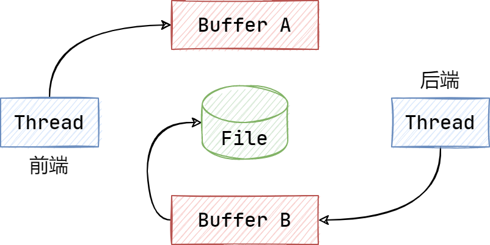
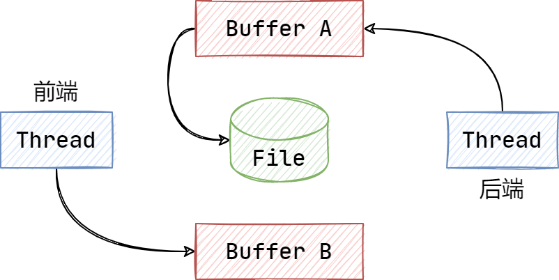
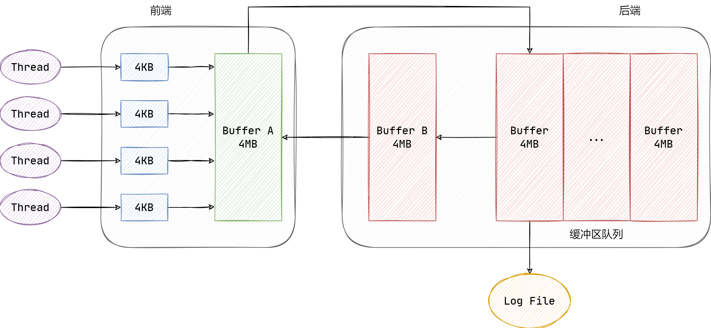
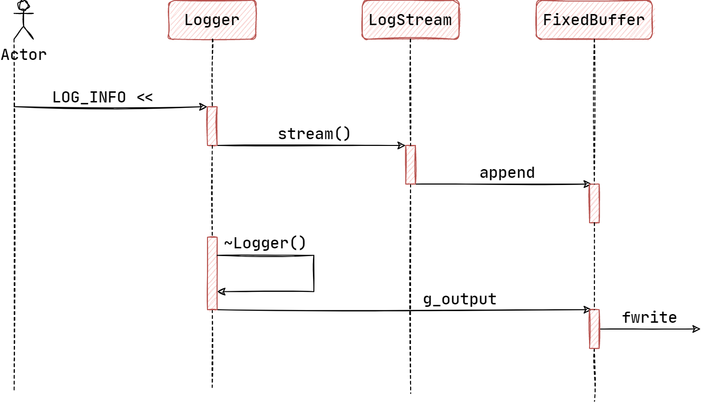
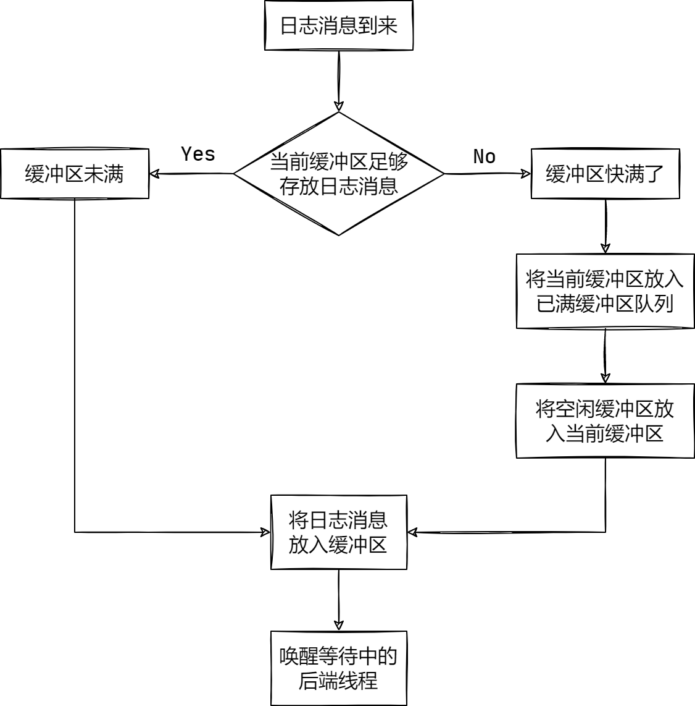
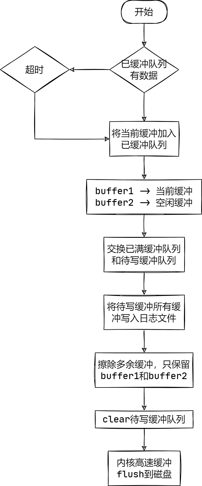

# Muduo 日志模块设计

异步日志的好处是前台线程不会阻塞在写日志上，后台线程真正写日志时，日志消息往往已经积累了很多，此时只需一次 IO 操作，从而减少了 IO 函数的调用次数，提高了效率。

Muduo日志大体可以分为前端和后端两部分：
- 前端：生成日志消息到缓冲区
- 后端：将缓冲区中的日志消息输出到本地文件

日志的前端与后端就是一个典型的 "多生产者——单消费者" 问题：
- 对于生产者而言，要尽可能坐到低延迟、低 CPU 开销、无阻塞；
- 对于消费者而言，要做到足够大的吞吐量，并占用少的资源；
  
对于日志消息而言，要做到以下几点：
- 每条日志消息占一行，且格式明确，便于 awk、grep 工具分析；
- 打印线程ID、日志级别、源文件、行号；
- 时间戳精确到微秒；
- 对于分布式系统而言，使用 GMT 时区；

## 设计思路

每一次日志操作，都进行三个步骤：(1)打开文件;(2)写文件;(3)关闭文件;

但是，当写入日志的频率较高时，磁盘 IO 占用较高。尽管在多线程文件操作中是线程安全的，但是多个线程写入日志的顺序确难以保证。

同时，如果单次输出的日志量太少，从打开文件、写文件到关闭文件耗费了太多的 IO 时间。

为此，可以在应用程序启动之初打开全局文件一次，后续每次日志操作，只需写入文件即可。

由于文件操作默认是存在缓冲区的，只有当缓冲区存满后，才将缓冲区的内容输出到文件中。相较于频繁的打开文件，此方案减少了打开文件、关闭文件的次数，效率得到了提升。

    C++ 中的 ostream 并非线程安全，而 C 中的 fwrite 则是线程安全的。

muduo 库所采用的双缓冲技术，前端负责向 Buffer 中填入数据，后端则负责将 Buffer 中的数据取出来写入到文件。

## 设计细节

### 1. 缓冲区

缓冲区是前端和后端之间通信的桥梁。

如图所示，准备两块缓冲区 Buffer A 和 Buffer B，前端负责往 Buffer A 中写入日志消息，后端负责将 Buffer B 中的日志消息写入文件：



当 Buffer A 写满之后，交换 A 和 B，让后端将 Buffer A 中的日志消息写入文件，而前端则往 Buffer B 中写入新的日志消息，如此反复。



在大部分的时间中，前端线程和后端线程不会操作同一个缓冲区，这也就意味着前端线程的操作，不需要等待后端线程缓慢的写文件操作，因为不需要锁定临界区。

前端线程和后端线程仅仅只在交换缓冲区时会存在线程同步问题，因此只需要在交换缓冲区时使用互斥锁来保护临界区即可，这个时间极其短暂，这也就是提高吞吐量的关键所在。

同时，后端线程将缓冲区中的日志消息写入到文件系统中的频率，完全由自己的写入策略来决定，避免了每条新的日志消息都唤醒后端线程。

换言之，前端线程不是将一条条日志消息分别传送给后端线程，而是将多条消息组成一个大的 Buffer 传递给后端进行处理，相当于批量处理，减少了线程唤醒的频率和 IO 操作次数，降低开销。

在 Muduo 的实现中，在后端设置了一个已满缓冲区的队列，用于缓冲一个周期内临时要写的日志消息：



### 2. LogStream

FixedBuffer 类是作为 LogStream 类类型的缓冲区对象，其是一个模板类，传入一个非类型参数 SIZE 用来表示缓冲区的大小，其示意图如图所示：


如图所示，其在栈上维护一段大小为 SIZE 的内存区域，length 为已写入数据的长度，而 avail 为剩余可用的数据长度。

SmallBuffer 的默认大小为 4KB，为前端的 LogStream 所持有。而 LargeBuffer 的默认大小为 4MB，为后端 的 AsyncLogging 所持有。

对于 LogStream 类类型来说，它将要输出的信息加载到 FixedBuffer 的缓冲区中，等待后续的处理。它通过重载 << 运算符来输出基本的数据类型到缓冲区。各种输入类型的调用链如下所示：


    注意：LogStream 不是线程安全的，因此对于每个 log 消息应当构造一个临时的 LogStream，用完之后随即销毁。

在该类中，设计了大量的运算符重载函数，其效率要优于 iostream 和 stdio，使用的思想源于 Matthew Wilson 的 “带符号整形数据的除法与余数” 算法实现。其巧妙之处在于，用一个对称的 digits 数组搞定了负数转换的边界条件(二进制补码的正负数表示范围不对称):
```C++
const char digits[] = "9876543210123456789";
````
此外，由于 LogStream 本身并不支持格式化，因此设计 Fmt 类类型将数值类型数据转化为一个长度不超过 32 位的字符对象 Fmt，并重载了支持 Fmt 输出到 LogStream 的 << 操作符模板函数。

### 3. Logging

在 Logger 类中定义了枚举变量 LogLevel 来作为日志等级：

| 日志等级 | 说明 |
| ----- | ----- |
|TRACE	|跟踪：指明程序的运行轨迹，比 DEBUG 级别的粒度更细|
|DEBUG	|调试：指明细致的事件信息，对调试应用最有用|
|INFO	|信息：指明描述信息，从粗粒度上描述了应用的运行过程|
|WARN	|警告：指明可能潜在的危险情况|
|ERROR	|错误：指明错误事件，但应用可能还能继续运行|
|FATAL	|致命：指明非常严重的可能导致应用终止执行的错误事件|

如果日志设置为 L，一个日志级别为 P 的输出日志只有满足 P≥L 时日志才会输出。

Logger 类使用了桥接模式，其具体实现交给内嵌类 Impl 来完成，它主要负责整合日志信息，主要包括：日期、时间、微秒、线程、日志级别、日志正文、源文件名、行号。其通过成员变量 stream_ 将日志输出到缓冲区中

除此之外，内嵌类 SourceFile 的目的是为了在编译期计算源文件的名称。

Logger 内部有两个成员变量 OutputFunc 和 FlushFunc，均为函数指针，分别指向输出函数和刷新函数，默认的输出函数使用线程安全的 fwrite() 函数，默认的刷新函数使用 fflush()。

```C++
void defaultOutput(const char* msg, int len) {
  size_t n = fwrite(msg, 1, len, stdout);
  (void)n;
}
 
void defaultFlush() {
  fflush(stdout);
}
```
同时，通过全局变量 g_output 和 g_flush 来控制输出函数和刷新函数，使用 g_logTimeZone 来设置时区：

```C++
Logger::OutputFunc g_output = defaultOutput;
Logger::FlushFunc g_flush = defaultFlush;
TimeZone g_logTimeZone;
```

文件内部定义了多个宏来便于调用 Logger 将日志追加到缓冲区中，如果当前日志消息等级低于 g_logLevel，就不会进行任何操作，几乎 0 操作，这是通过宏中的 if 语句实现的。
```C++
#define LOG_TRACE if (muduo::Logger::logLevel() <= muduo::Logger::TRACE) \
  muduo::Logger(__FILE__, __LINE__, muduo::Logger::TRACE, __func__).stream()
#define LOG_DEBUG if (muduo::Logger::logLevel() <= muduo::Logger::DEBUG) \
  muduo::Logger(__FILE__, __LINE__, muduo::Logger::DEBUG, __func__).stream()
#define LOG_INFO if (muduo::Logger::logLevel() <= muduo::Logger::INFO) \
  muduo::Logger(__FILE__, __LINE__).stream()
#define LOG_WARN muduo::Logger(__FILE__, __LINE__, muduo::Logger::WARN).stream()
#define LOG_ERROR muduo::Logger(__FILE__, __LINE__, muduo::Logger::ERROR).stream()
#define LOG_FATAL muduo::Logger(__FILE__, __LINE__, muduo::Logger::FATAL).stream()
#define LOG_SYSERR muduo::Logger(__FILE__, __LINE__, false).stream()
#define LOG_SYSFATAL muduo::Logger(__FILE__, __LINE__, true).stream()
```

在 Logger 的析构函数中，先由 impl_ 往缓冲区后添加后缀，即文件名和行数以及换行符，然后调用 g_output 将缓冲区内容输出到指定的文件流。

```C++
Logger::~Logger() {
  impl_.finish();
  const LogStream::Buffer& buf(stream().buffer());
  g_output(buf.data(), buf.length());
  if (impl_.level_ == FATAL) {
    g_flush();
    abort();
  }
}
```
前端日志的时序图如下：


### 4. LogFile
LogFile 主要负责对日志文件的操作，包括日志文件的滚动和写入，其构造函数如下：

```C++
LogFile::LogFile(const string& basename,
                 off_t rollSize,
                 bool threadSafe,
                 int flushInterval,
                 int checkEveryN)
  : basename_(basename),
    rollSize_(rollSize),
    flushInterval_(flushInterval),
    checkEveryN_(checkEveryN),
    count_(0),
    mutex_(threadSafe ? new MutexLock : NULL),
    startOfPeriod_(0),  // 本次写日志的起始时间
    lastRoll_(0), // 上次滚动日志文件的时间
    lastFlush_(0) { // 上次刷新日志文件的时间
  assert(basename.find('/') == string::npos);
  rollFile();
}
```
变量 threadSafe 主要用于控制日志后端的线程安全，默认为 true。当只有一个后端线程来处理日志消息时，则无需线程安全。rollSize 表示一次最大刷新的字节数，flushInterval 表示刷新的时间间隔，单位为毫秒。

checkEveryN 表示写数据的次数限制，默认为 1024。count_ 用来计数当前写数据的次数，如果超过 checkEveryN 则清除以重新计数。

mutex_ 根据是否需要开启线程安全来决定是否需要初始化互斥锁指针。

当写数据的次数超过指定的写数据限制时，需要写入新的日志文件，这是通过 rollFile() 来实现的：
```C++
bool LogFile::rollFile() {
  time_t now = 0;
  string filename = getLogFileName(basename_, &now);
  time_t start = now / kRollPerSeconds_ * kRollPerSeconds_;
 
  if (now > lastRoll_) {
    lastRoll_ = now;
    lastFlush_ = now;
    startOfPeriod_ = start;
    file_.reset(new FileUtil::AppendFile(filename));
    return true;
  }
  return false;
}
```
其创建并打开一个新的日志文件，然后更改 unique_ptr 所指向的文件对象。

为了避免频繁的创建新的文件，该函数确保上次滚动事件到现在如果不足 1 秒，就不会发生滚动：
```C++
void LogFile::append_unlocked(const char* logline, int len) {
  file_->append(logline, len);
  if (file_->writtenBytes() > rollSize_) {
    rollFile();
  } else {
    ++count_;
    if (count_ >= checkEveryN_) {
      count_ = 0;
      time_t now = ::time(NULL);
      time_t thisPeriod_ = now / kRollPerSeconds_ * kRollPerSeconds_;
      if (thisPeriod_ != startOfPeriod_) {
        rollFile();
      } else if (now - lastFlush_ > flushInterval_) {
        lastFlush_ = now;
        file_->flush();
      }
    }
  }
}
```

日志名的生成是通过如下函数实现的：
```C++
string LogFile::getLogFileName(const string& basename, time_t* now) {
  string filename;
  filename.reserve(basename.size() + 64);
  filename = basename;
  char timebuf[32];
  struct tm tm;
  *now = time(NULL);
  gmtime_r(now, &tm);
  strftime(timebuf, sizeof timebuf, ".%Y%m%d-%H%M%S.", &tm);
  filename += timebuf;
  filename += ProcessInfo::hostname();
  char pidbuf[32];
  snprintf(pidbuf, sizeof pidbuf, ".%d", ProcessInfo::pid());
  filename += pidbuf;
  filename += ".log";
  return filename;
}
```

日志的文件名是通过 [基础名].[当前时间].[主机名].[进程号].log 来构成的。

LogFile 通过 append() 方法将日志写入文件，它实质上调用的是 append_unlocked() 方法，同时根据是否开启线程安全来决定是否需要添加互斥锁来保护临界区。

同样地，刷新操作也是根据是否启用线程安全来决定是否添加互斥锁保护临界区，其内部调用的是 AppendFile::flush() 方法。

### 5. AsyncLogging

AsyncLogging 主要负责提供大缓冲区，即 LargeBuffer，默认大小为 4MB，以存放多条日志消息，而成员变量 BufferVector 则用于存放多个 LargeBuffer。其构造函数如下：
```C++
class AsyncLogging : noncopyable {
private:
  // Large Buffer Type
  typedef muduo::detail::FixedBuffer<muduo::detail::kLargeBuffer> Buffer;
  typedef std::vector<std::unique_ptr<Buffer>> BufferVector; // 已满缓冲队列类型
  typedef BufferVector::value_type BufferPtr;
 
  const int flushInterval_;                    // 冲刷缓冲数据到文件的超时时间, 默认3秒
  std::atomic<bool> running_;                  // 后端线程loop是否运行标志
  const string basename_;                      // 日志文件基本名称
  const off_t rollSize_;                       // 日志文件滚动大小
  muduo::Thread thread_;                       // 后端线程
  muduo::CountDownLatch latch_;                // 门阀, 同步调用线程与新建的后端线程
  muduo::MutexLock mutex_;                     // 互斥锁, 功能相当于std::mutex
  muduo::Condition cond_ GUARDED_BY(mutex_);   // 条件变量, 与mutex_配合使用, 等待特定条件满足
  BufferPtr currentBuffer_ GUARDED_BY(mutex_); // 当前缓冲
  BufferPtr nextBuffer_ GUARDED_BY(mutex_);    // 空闲缓冲
  BufferVector buffers_ GUARDED_BY(mutex_);    // 已满缓冲队列
}
 
```
前端线程通过调用 LOG_XXX << "..." 输出日志消息时，可以通过调用 AsyncLogging::append() 方法将日志消息传递给后端：
```C++
void AsyncLogging::append(const char *logline, int len) {
  muduo::MutexLockGuard lock(mutex_);
  if (currentBuffer_->avail() > len) {
      currentBuffer_->append(logline, static_cast<size_t>(len));
  } else {
    buffers_.push_back(std::move(currentBuffer_));
 
    if (nextBuffer_) {
      currentBuffer_ = std::move(nextBuffer_);
    } else {
      currentBuffer_.reset(new Buffer);
    }
 
    currentBuffer_->append(logline, static_cast<size_t>(len));
    cond_.notify();
  }
}
```
由于 append() 可能被多个前端线程调用，因此必须考虑线程安全，采用互斥锁加锁。其基本思路如下图所示：


最后需要唤醒后端线程，是因为后端线程很可能阻塞等待日志消息，当缓冲区满时，能及时唤醒后端线程将已满的数据写入到磁盘上，否则短时间内如果产生大量的日志消息，会造成数据堆积，甚至丢失，而后端线程一直休眠，直到 3 秒超时后唤醒。

后端线程的启动和结束是在如下两个方法中：
```C++
void start() {
  running_ = true;
  thread_.start();
  latch_.wait();
}
 
void stop() NO_THREAD_SAFETY_ANALYSIS {
  running_ = false;
  cond_.notify();
  thread_.join();
}
```
其中变量 latch_ 的作用是等待 thread_ 线程启动完成。stop() 则用于关闭后端线程，通常实在析构函数中自动调用：
```C++
~AsyncLogging() {
  if (running_) {
    stop();
  }
}
```
后端线程函数 threadFunc，会创建 1 个 LogFile 对象，用于控制日志文件的创建和写日志数据，创建 2 个空闲缓冲区 buffer1、buffer2，和一个待写缓冲队列 buffersToWrite，分别用于替换当前缓冲 currentBuffer_、空闲缓冲 nextBuffer_、已满缓冲队列 buffers_，避免在写文件过程中，锁住缓冲区和队列，导致前端无法写数据到后端缓冲。

threadFunc 内部的 loop 流程如下：
