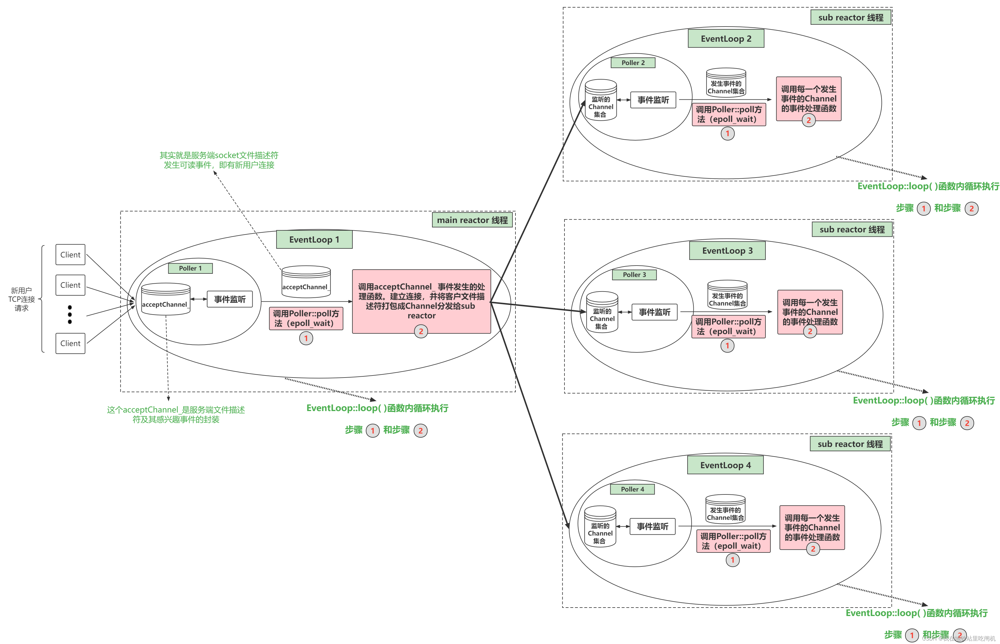

# 基本组件

one loop per thread, 每个loop里包含一个poller和一组channel,二者没有耦合性，但是都持有其所在loop的指针 m_loop，通过这个指针相互关联。

## 1. Channel

```C++
// 封装了 sockfd 和 感兴趣的 event ，还包含了 poller返回的具体事件
class Channel : noncopyable
{
public:
    using EventCallBack = std::function<void()>;
    using ReadEventCallBack = std::function<void(Timestamp)>;
private:

    static const int kNoneEvent;
    static const int kReadEvent;
    static const int kWriteEvent;

    EventLoop *m_loop; // 本 channel 所在的 事件循环
    int m_fd;          // poller 监听的对象
    int m_events;      // fd 上感兴趣的事件
    int m_revents;     // poller 返回的具体发生的事件
    int m_index;

    std::weak_ptr<void> m_tie;
    bool m_tied;

    // channel 可以获知 fd 里面具体发生的事件 revents ， 它负责具体事件的回调操作
    ReadEventCallBack m_readCallBack;
    EventCallBack m_writeCallBack;
    EventCallBack m_closeCallBack;
    EventCallBack m_errorCallBack;
};
```

Channel类相当于一个文件描述符的保姆，封装了一个 [fd] 和这个 [fd感兴趣事件] 以及事件监听器监听到 [该fd实际发生的事件]。
同时Channel类还提供了设置该fd的感兴趣事件，以及将该fd及其感兴趣事件注册到事件监听器或从事件监听器上移除，以及保存了该fd的每种事件对应的处理函数。

- **m_fd** : Channel 对象照看的文件描述符
- **m_events** : m_fd 上感兴趣的事件类型集合
- **int m_revents** : m_fd 上发生的事件类型集合，当事件监听器监听到一个fd发生了什么事件，通过Channel::set_revents()函数来设置revents值。
- EventLoop* **m_loop** ：m_fd 从属的 EventLoop
- 一堆**callBack** ：std::function类型，代表这个Channel为这个文件描述符保存的各事件类型发生时的回调函数。比如这个fd发生了可读事件，需要执行可读事件处理函数，这时候Channel类都替你保管好了这些可调用函数，要用执行的时候直接管保姆要就可以了。上层会绑定这些函数，而不会直接回调函数，发生事件之后回调**handle_events**函数，这个函数最终调用私有接口**handleEventWithGuard**来执行回调函数，接口代码如下
  
```C++
void Channel::handleEventWithGuard(Timestamp recvTime)
{
    if ((m_revents & EPOLLHUP) && !(m_revents & EPOLLIN))
    {
        if (m_closeCallBack) m_closeCallBack();
    }

    if (m_revents & EPOLLERR)
    {
        if (m_errorCallBack) m_errorCallBack();
    }

    if (m_revents & (EPOLLIN | EPOLLPRI))
    {
        if (m_readCallBack) m_readCallBack(recvTime);
    }

    if (m_revents & EPOLLOUT)
    {
        if (m_writeCallBack) m_writeCallBack();
    }
}
```

关于 m_tie 和 m_tied

```C++
// 用一个弱指针将 Channel 对象和 后面介绍的 TcpConnection 对象绑定在一起
// 防止 remove 掉 TcpConnection 之后，还在执行回调操作
void Channel::tie(const std::shared_ptr<void> & obj)
{
    m_tie = obj;
    m_tied = true;
}
```

## 2. Poller / Epoller

负责监听文件描述符事件是否触发以及返回发生事件的文件描述符以及具体事件的模块就是Poller。所以一个Poller对象对应一个事件监听器在multi-reactor模型中，有多少reactor就有多少Poller。

重构的muduo库只支持epoll。

这个Poller是个抽象虚类，由EpollPoller和PollPoller继承实现，与监听文件描述符和返回监听结果的具体方法也基本上是在这两个派生类中实现。EpollPoller就是封装了用epoll方法实现的与事件监听有关的各种方法。

主要成员：

```C++
// poller.h
class Poller : noncopyable
{
public:
    using ChannelList = std::vector<Channel*>;
    // Must be called in the loop thread.
    // 给所有 IO 复用保留统一的接口去重写 --> 相当于启动 epoll_wait
    virtual Timestamp poll(int timeoutMs, ChannelList * activeChannels) = 0;
protected:
    // fd : channel
    using ChannelMap = std::unordered_map<int, Channel*>;
    ChannelMap m_channels;
private:
    EventLoop * m_ownerloop;
};

// epollpoller.h
class EpollPoller : public Poller
{
private:
    static const int kInitEventListSize = 16;
    using EventList = std::vector<epoll_event>;
    int m_epollfd;
    EventList m_events;
};
```

- **m_epollfd**: 就是用epoll_create方法返回的epoll句柄
- **m_channels**：负责记录 文件描述符 —> 对应Channel的映射，也帮忙保管所有 注册在这个Poller上的Channel。
- **m_ownerLoop**：所属的EventLoop对象

核心成员函数：

```C++
// poller.cc
// Must be called in the loop thread.
// 给所有 IO 复用保留统一的接口去重写 --> 相当于启动 epoll_wait
virtual Timestamp poll(int timeoutMs, ChannelList * activeChannels) = 0;

// epollpoller.cc
Timestamp EpollPoller::poll(int timeoutMs, ChannelList * activeChannels)
{
    int numEvents = ::epoll_wait(m_epollfd, 
                                 &*m_events.begin(),
                                 static_cast<int>(m_events.size()),
                                 timeoutMs);
    int saveErrno = errno;
    Timestamp now(Timestamp::now());
    if (numEvents > 0)
    {

        fillActivateChannels(numEvents, activeChannels);
        if (numEvents == m_events.size())
        {
            m_events.resize(m_events.size() * 2);
        }
    }
    else if (numEvents == 0)
    {
    }
    else
    {
        if (saveErrno != EINTR)
        {
        }
    }
    return now;
}

```

当loop调用poll方法的时候，该方法底层其实是通过epoll_wait获取这个事件监听器上发生事件的fd及其对应发生的事件，(每个fd都是由一个Channel封装的，通过哈希表m_channels可以根据fd找到封装这个fd的Channel)。事件监听器监听到该fd发生的事件写进这个Channel中的revents成员变量中。然后把这个Channel装进activeChannels中（它是一个vector<Channel*>），即m_ownerLoop的m_channelList。当调用完poll之后就能拿到事件监听器的监听结果

## 3. EventLoop

```c++
class EventLoop : noncopyable
{
public:
    using Functor = std::function<void()>;

    void loop(); // 开启事件循环

    void runInLoop(Functor cb);   // 在当前loop中执行cb
    void queueInLoop(Functor cb); // 把cb放入队列

    // 内部接口
    void wakeUp(); // 唤醒 loop 所在线程
    void updateChannel(Channel *channel);
    void removeChannel(Channel *channel);

    bool isInLoopThread() const { return m_threadId == CurrentThread::tid(); }

private:
    void handleRead();        // waked up
    void doPendingFunctors(); // 回调

    using ChannelList = std::vector<Channel *>;

    std::atomic_bool m_callingPendingFunctors; // 标识当前线程是否有需要回调的操作
    const pid_t m_threadId;                    // 当前loop所在线程的id
    std::unique_ptr<Poller> m_poller;
    int m_wakeupFd;                           // 通过eventfd系统调用，mainloop拿到新的channel后，轮询选择一个subloop，通过该成员唤醒subloop
    std::unique_ptr<Channel> m_wakeupChannel; // 包含 m_wakeupFd 以及对应的事件

    ChannelList m_channelList;
    Channel *m_currentActiveChannel;

    std::mutex m_mutex;                     // 保护m_pendingFunctors的线程安全
    std::vector<Functor> m_pendingFunctors; // 存储loop需要执行的所有回调操作
};
```

Poller是封装了和事件监听有关的方法和成员，调用一次Poller::poll方法它就能返回事件监听器的监听结果（发生事件的fd 及其 发生的事件）。作为一个网络服务器，需要有持续监听、持续获取监听结果、持续处理监听结果对应的事件的能力，也就是我们需要循环的去 调用Poller:poll方法获取实际发生事件的Channel集合，然后调用这些Channel里面保管的不同类型事件的回调函数（调用Channel::handlerEvent方法）

EventLoop就是负责 实现“循环”、驱动“循环”的重要模块。Channel和Poller其实相当于EventLoop的手下，EventLoop整合封装了二者并向上提供了更方便的接口来使用。

EventLoop起到一个驱动循环的功能，Poller负责从事件监听器上获取监听结果。而Channel类则在其中起到了将fd及其相关属性封装的作用，将fd及其感兴趣事件和发生的事件以及不同事件对应的回调函数封装在一起，这样在各个模块中传递更加方便。接着EventLoop调用。


acceptor 相当于主loop，当有连接发生，则主loop回调 **m_acceptChannel** 上绑定的连接回调 **handleRead()**，该函数先打包fd为channel，再调用 m_newConnCallBack 分发给 sub_loop，其中 m_newConnCallBack 为 tcpserver 为 acceptor 注册的连接回调，正常情况下其代码如下 ：

```C++
// 新用户连接触发 m_acceptChannel
void Acceptor::handleRead()
{
    InetAddress peerAddr;
    int connfd = m_acceptSocket.accept(&peerAddr);
    if (connfd >= 0)
    {
        if (m_newConnCallBack)
        {
            // 轮询 sub_loop ...
            m_newConnCallBack(connfd, peerAddr);
        }
    }
}

/**
 * @brief 轮询选择一个 subloop
 *        唤醒 subloop
 *        把当前的 connfd 封装成 channel 分发给 subloop
 *        这里的分发就是让新创建的 TcpConnection 拿到一个 sub_loop 的指针，
 *        而后在 sub_loop 中执行 TcpConnection::connectEstablished() 回调函数
*/
void TcpServer::newConn(int sockfd, const InetAddress & peerAddr)
{
    EventLoop * ioLoop = m_threadPool->getNextLoop();
    char buf[64] = {0};
    snprintf(buf, sizeof buf, "-%s#%d", m_ipPort.c_str(), m_nextConnId);
    ++m_nextConnId;
    std::string connName = m_name + std::string(buf);

    sockaddr_in local;
    ::bzero(&local, sizeof local);
    socklen_t addrlen = sizeof local;
    if (::getsockname(sockfd, (sockaddr *)&local, &addrlen) < 0)
    {
    }
    InetAddress localAddr(local);
    // localAddr, peerAddr
    TcpConnectionPtr conn(new TcpConnection(ioLoop,
                                            connName,
                                            sockfd,
                                            localAddr,
                                            peerAddr));
    m_connections[connName] = conn;
    conn->setConnectionCallBack(m_connCallback);
    conn->setMsgCallBack(m_msgCallBack);
    conn->setWriteCompleteCallBack(m_writeCompleteCallBack);
    conn->setCloseCallBack(std::bind(&TcpServer::removeConn, this, std::placeholders::_1));
    ioLoop->runInLoop(std::bind(&TcpConnection::connectEstablished, conn));
}
```

## 4. TcpConnection

```C++
/**
 * 封装 socket channel client_callback，已经建立连接的链路
 * TcpServer -> Acceptor -> 新用户连接，通过accept函数得到一个connfd
 *  -> TcpConnection 设置回调 -> Channel -> Poller -> Channel的回调操作
 * */ 
class TcpConnection : noncopyable , public std::enable_shared_from_this<TcpConnection>
{
public:
    TcpConnection(EventLoop * loop,
                  const std::string & name,
                  int sockfd,
                  const InetAddress & localAdd,
                  const InetAddress & peerAddr);
    // called when TcpServer accepts a new connection
    void connectEstablished(); // should be called only once
    // called when TcpServer has removed me from its map
    void connectDestroyed(); // should be called only once
private:
    // 连接状态
    enum StateE { kDisconnected, kConnecting, kConnected, kDisconnecting };
    void sendInLoop(const void * msg, size_t len);

    // sub_loop,TcpConnection 都是在sub_loop中管理
    EventLoop * m_loop;
    const std::string m_name;
    std::atomic_int m_state;
    bool m_reading;

    std::unique_ptr<muduoSocket> m_socket;
    std::unique_ptr<Channel> m_channel;

    const InetAddress m_localAddr; // 当前主机地址
    const InetAddress m_peerAddr; // 对端地址

    ConnectionCallBack m_connectionCallBack;
    MsgCallback m_msgCallBack;
    WriteCompleteCallBack m_writeCompleteCallBack;
    CloseCallBack m_closeCallBack;
    HighWaterMarkCallback m_highWaterMarkCallBack;

    size_t m_highWaterMark;

    Buffer m_inputBuffer; // 接收缓冲区
    Buffer m_outputBuffer; // 发送缓冲区
};
```

主要封装了一个已建立的TCP连接，以及控制该TCP连接的方法（连接建立和关闭和销毁），以及该连接发生的各种事件（读/写/错误/连接）对应的处理函数，以及这个TCP连接的服务端和客户端的套接字地址信息等。
TcpConnection 类和 Acceptor 类是兄弟关系，Acceptor 用于 main_loop 中，对服务器监听套接字fd及其相关方法进行封装（监听、接受连接、分发连接给sub_loop等），TcpConnection 用于 SubEventLoop 中，对连接套接字fd及其相关方法进行封装（读消息事件、发送消息事件、连接关闭事件、错误事件等）。

## 5. [Buffer 与日志一起](basiclog.md)

在 [读写操作](basicReadWriteModel.md) 的最后也有提及
