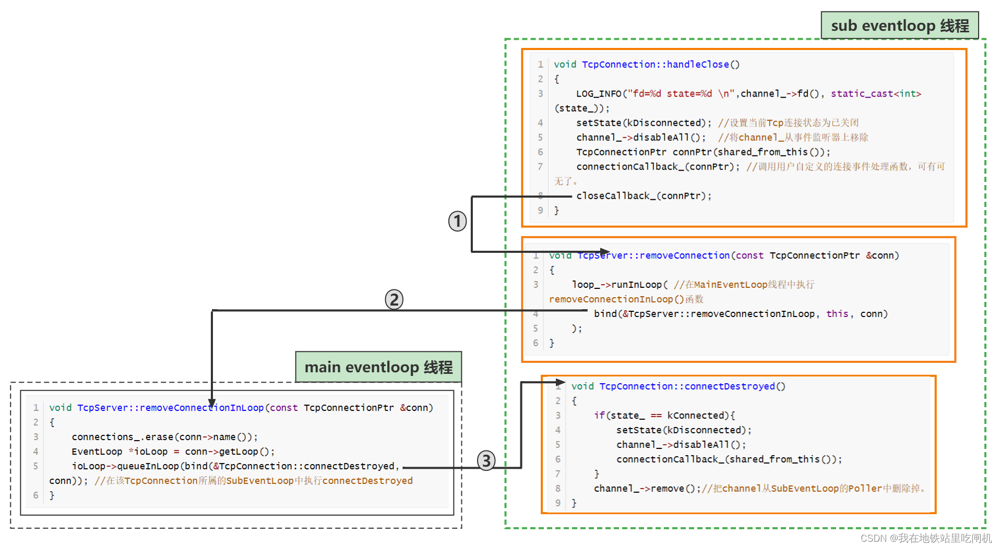
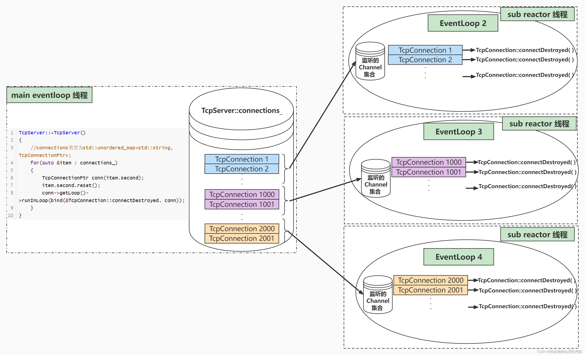

# 连接断开逻辑

## 被动断开

服务端 TcpConnection::handleRead() 中感知到客户端把连接断开。TcpConnection::handleRead( )函数内部调用了Linux的函数readv( )，当readv( )返回0的时候，服务端就知道客户端断开连接了。然后就接着调用TcpConnection::handleClose( )。

```C++
void TcpConnection::handleClose()
{
    setState(kDisconnected);
    m_channel->disableAll();
    TcpConnectionPtr guardThis(shared_from_this());
    m_connectionCallBack(guardThis);
    // must be the last line
    m_closeCallBack(guardThis);
}

// TcpConnection::m_closeCallBack 在连接建立时被绑定为如下函数
// 在 main_loop 中执行
void TcpServer::removeConn(const TcpConnectionPtr & conn)
{
    m_loop->runInLoop(std::bind(&TcpServer::removeConnInLoop, this, conn));
}
```



上图中的标号1、2、3是函数调用顺序，我们可以看到：

- 1. 在执行TcpConnection::handle_Close()的时候，该函数还是在SubEventLoop线程中运行的，接着调用closeCallback_(connPtr)回调函数，该函数保存的其实是TcpServer::removeConnection( )函数
- 2. TcpServer::removeConnection( )函数调用了remvoveConnectionInLoop( )函数，该函数的运行是在MainEventLoop线程中执行的。
- 3. removeConnectionInLoop( )函数：TcpServer对象中有一个connections_成员变量，这是一个unordered_map，负责保存【string --> TcpConnection】的映射，其实就是保存着Tcp连接的名字到TcpConnection对象的映射。因为这个Tcp连接要关闭了，所以也要把这个TcpConnection对象从connections_中删掉。然后再调用TcpConnection::connectDestroyed函数。
另外为什么removeConnectionInLoop()要在MainEventLoop中运行，因为该函数主要是从TcpServer对象中删除某条数据。而TcpServer对象是属于MainEventLoop的。这也是贯彻了One Loop Per Thread的理念。
- 4. TcpConnection::connectDestroyed( )函数的执行是又跳回到了subEventLoop线程中。该函数就是将Tcp连接的监听描述符从事件监听器中移除。另外SubEventLoop中的Poller类对象还保存着这条Tcp连接的channel_，所以调用channel_.remove( )将这个Tcp连接的channel对象从Poller内的数据结构中删除。

## 服务器主动关闭导致连接断开

当服务器主动关闭时，调用TcpServer::~TcpServer()析构函数。

TcpConnection对象的析构问题：
这里在提示一下EventLoop::runInLoop()函数的意义，假如有一个EventLoop对象 loop_，当调用了loop_->runInLoop(function)函数时，这个function函数的执行会在这个loop_绑定的线程上运行

所以我们画了下面这幅图，在创建TcpConnection对象时，Acceptor都要将这个对象分发给一个SubEventLoop来管理。这个TcpConnection对象的一切函数执行都要在其管理的SubEventLoop线程中运行。再一次贯彻One Loop Per Thread的设计模式。比如要想彻底删除一个TcpConnection对象，就必须要调用这个对象的**connecDestroyed()**方法，**这个方法执行完后才能释放这个对象的堆内存**。每个TcpConnection对象的connectDestroyed()方法都必须在这个TcpConnection对象所属的SubEventLoop绑定的线程中执行。



所有上面的TcpServer::~TcpServer()函数就是干这事儿的，不断循环的让这个TcpConnection对象所属的SubEventLoop线程执行TcpConnection::connectDestroyed()函数，同时在MainEventLoop的TcpServer::~TcpServer()函数中调用item.second.reset()释放保管TcpConnection对象的共享智能指针，以达到释放TcpConnection对象的堆内存空间的目的。

但是这里面其实有一个问题需要解决，TcpConnection::connectDestroyed()函数的执行以及这个TcpConnection对象的堆内存释放操作不在同一个线程中运行，所以要考虑怎么保证一个TcpConnectino对象的堆内存释放操作是在TcpConnection::connectDestroyed()调用完后。

这个析构函数巧妙利用了共享智能指针的特点，当没有共享智能指针指向这个TcpConnection对象时（引用计数为0），这个TcpConnection对象就会被析构删除（堆内存释放）。

```C++
TcpServer::~TcpServer()
{
    for (auto & it : m_connections)
    {
        // 栈上的 conn 接管了 m_connections 中的 TcpConnectionPtr，再把
        // TcpConnectionPtr 置空，出来循环，析构 conn
        TcpConnectionPtr conn(it.second);
        it.second.reset();
        conn->getLoop()->runInLoop(std::bind(&TcpConnection::connectDestroyed, conn));
    }
}
```

- 1. 在一开始，每一个TcpConnection对象都被一个共享智能指针TcpConnetionPtr持有，当执行了TcpConnectionPtr conn(item.second)时，这个TcpConnetion对象就被conn和这个item.second共同持有，但是这个conn的生存周期很短，只要离开了当前的这一次for循环，conn就会被释放。
- 2. 紧接着调用item.second.reset()释放掉TcpServer中保存的该TcpConnectino对象的智能指针。此时在当前情况下，只剩下conn还持有这个TcpConnection对象，因此当前TcpConnection对象还不会被析构。
- 3. 接着调用了conn->getLoop()->runInLoop(bind(&TcpConnection::connectDestroyed, conn));
即让SubEventLoop线程去执行TcpConnection::connectDestroyed()函数。当把这个conn的成员函数传进去的时候，conn所指向的资源的引用计数会加1。因为传给runInLoop的不只有函数，还有这个函数所属的对象conn。
- 4. SubEventLoop线程开始运行TcpConnection::connectDestroyed()
- 5. MainEventLoop线程当前这一轮for循环跑完，共享智能指针conn离开代码块，因此被析构，但是TcpConnection对象还不会被释放，因为还有一个共享智能指针指向这个TcpConnection对象，而且这个智能指针在TcpConnection::connectDestroyed()中，只不过这个智能指针你看不到，它在这个函数中是一个隐式的this的存在。当这个函数执行完后，智能指针就真的被释放了。到此，就没有任何智能指针指向这个TcpConnection对象了。TcpConnection对象就彻底被析构删除了。

## 如果TcpConnection中有正在发送的数据，怎么保证在触发TcpConnection关闭机制后，能先让TcpConnection先把数据发送完再释放TcpConnection对象的资源？

TcpConnection类继承了一个类

```C++
class TcpConnection :public std::enable_shared_from_this<TcpConnection>
```

每一个TcpConnection与对应的Channel关联

```C++
    /**** channel.h : class channel ****/ 
    std::weak_ptr<void> m_tie;
    bool m_tied;

    void Channel::tie(const std::shared_ptr<void> & obj)
    {
        m_tie = obj;
        m_tied = true;
    }

    /**
     * 其中 m_tie 在 Channel::tie( ) 函数中初始化，
     * Channel::tie( )在 TcpConnection::connectEstablished 回调中调用
     * 绑定上连接对应的 TcpConnectionPtr上，充当一个观察者
     * 在 channel 的 handelEvent 函数中，使用观察者，TcpConnection 对象的线程安全
     * */ 
    void Channel::handelEvent(Timestamp receiveTime)
    {
        if (m_tied)
        {
            std::shared_ptr<void> guard = m_tie.lock();
            if (guard)
            {
                handleEventWithGuard(receiveTime);
            }
        }
        else
        {
            handleEventWithGuard(receiveTime);
        }
    }
```

当事件监听器返回监听结果，就要对每一个发生事件的channel对象调用他们的HandlerEvent()函数。
在这个HandlerEvent函数中，会先把 m_tie 这个 weak_ptr 提升为强共享智能指针。这个强共享智能指针会指向当前TcpConnection 对象。
就算外面调用删除析构了其他所有的指向该 TcpConnection 对象的智能指针。只要HandleEventWithGuard()函数没执行完，这个TcpConnetion 对象都不会被析构释放堆内存。而 HandleEventWithGuard() 函数里面就有负责处理消息发送事件的逻辑。当HandleEventWithGuard() 函数调用完毕，这个guard智能指针就会被释放。
