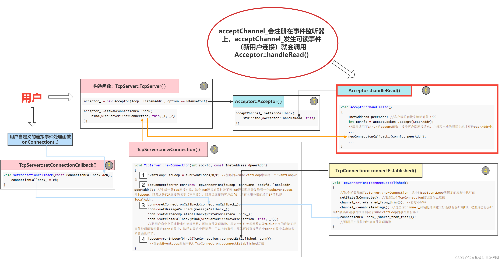

# 走一遍用户连接逻辑

回显服务器：

```C++
// echoserver.cc
#include <tinymuduo/tcpserver.h>
#include <functional>
#include <string>

class EchoServer
{
public:
    EchoServer(EventLoop *loop,
               const InetAddress &listenAddr,
               const std::string &name) : 
               m_loop(loop),
               m_server(m_loop, listenAddr, name)
    {
        // 注册回调
        m_server.setConnCallBack(std::bind(&EchoServer::onConnection, this, std::placeholders::_1));
        m_server.setMsgCallBack(std::bind(&EchoServer::onMessage, this,
                                          std::placeholders::_1,
                                          std::placeholders::_2,
                                          std::placeholders::_3));
        // 设置线程数
        m_server.setThreadNum(3);
    }
    void start()
    {
        m_server.start();
    }

private:
    void onConnection(const TcpConnectionPtr &conn)
    {
        if (conn->connected())
        {
        }
        else
        {
        }
    }

    void onMessage(const TcpConnectionPtr &conn,
                   Buffer *buf,
                   Timestamp time)
    {
        std::string msg(buf->retriveAllAsString());
        conn->send(msg);
        conn->shutdown(); // close write --> epoll closeCallBack
    }

    EventLoop *m_loop;
    TcpServer m_server;
};

int main()
{
    EventLoop loop;
    InetAddress addr(8000);

    // 建立acceptor，创建 non-blocking listenfd，bind
    EchoServer server(&loop, addr, "EchoServer");

    // listen， 创建loopthread，将listenfd打包为channel向main_loop注册
    server.start();

    loop.loop();

    return 0;
}
```

## 从TcpServer创建开始到连接建立的代码流程

```C++
// tcpserver.h
class TcpServer : noncopyable
{
public:
    using ThreadInitCallBack = std::function<void (EventLoop*)>;
    TcpServer(EventLoop * loop, 
              const InetAddress & listenAddr,
              const std::string & nameArgs,
              Option option = kNoReusePort);
    void start();
private:
    using ConnMap = std::unordered_map<std::string, TcpConnectionPtr>;
    EventLoop * m_loop; // main_loop/acceptor_loop
    const std::string m_ipPort;
    const std::string m_name;
    std::unique_ptr<Acceptor> m_acceptor; // 运行在main_loop
    std::shared_ptr<EventLoopThreadPool> m_threadPool; // one loop per thread
    ConnectionCallBack m_connCallback;
    MsgCallback m_msgCallBack;
    WriteCompleteCallBack m_writeCompleteCallBack;
    ThreadInitCallBack m_threadInitCallBack;
    std::atomic_int32_t m_started;
    int m_nextConnId;
    ConnMap m_connections;
};

// tcpserver.cc
// TcpServer构造
TcpServer::TcpServer(EventLoop * loop, 
            const InetAddress & listenAddr,
            const std::string & nameArgs,
            Option option) :
    m_loop(CheckLoopNotNull(loop)),
    m_ipPort(listenAddr.toIpPort()),
    m_name(nameArgs),
    m_acceptor(new Acceptor(loop, listenAddr, option = kReusePort)), // acceptor 初始化
    m_threadPool(new EventLoopThreadPool(loop, m_name)), // 线程池初始化
    m_connCallback(ConnectionCallBack()), // 连接回调和消息回调先绑一个空的, 在服务器程序中进行 用户自定义 set
    m_msgCallBack(MsgCallback()),         // 在 TcpServer 跑起来时，这两个都是有效的
    m_nextConnId(1),
    m_started(0)
{
    m_acceptor->setNewConnCallBack(std::bind(&TcpServer::newConn, 
                                             this, 
                                             std::placeholders::_1, 
                                             std::placeholders::_2));
}

// tcpserver.cc
// 走过来时已经完成连接，还要完成 该连接的 TcpConnecrion 的初始化和 分发工作
void TcpServer::newConn(int sockfd, const InetAddress & peerAddr)
{
    EventLoop * ioLoop = m_threadPool->getNextLoop();
    char buf[64] = {0};
    snprintf(buf, sizeof buf, "-%s#%d", m_ipPort.c_str(), m_nextConnId);
    ++m_nextConnId;
    std::string connName = m_name + std::string(buf);
    sockaddr_in local;
    ::bzero(&local, sizeof local);
    socklen_t addrlen = sizeof local;
    if (::getsockname(sockfd, (sockaddr *)&local, &addrlen) < 0)
    {
    }
    InetAddress localAddr(local);
    // localAddr, peerAddr
    TcpConnectionPtr conn(new TcpConnection(ioLoop,
                                            connName,
                                            sockfd,
                                            localAddr,
                                            peerAddr));
    m_connections[connName] = conn;
    conn->setConnectionCallBack(m_connCallback);
    conn->setMsgCallBack(m_msgCallBack);
    conn->setWriteCompleteCallBack(m_writeCompleteCallBack);
    conn->setCloseCallBack(std::bind(&TcpServer::removeConn, this, std::placeholders::_1));
    ioLoop->runInLoop(std::bind(&TcpConnection::connectEstablished, conn));
}

// tcpconnection.cc
// 只在连接建立时调用一次，关联 m_channel，调用使用者传进来的 onConnCallback
// 在 sub_loop 中调用
void TcpConnection::connectEstablished()
{
    setState(kConnected);
    m_channel->tie(shared_from_this());
    m_channel->enableReading();
    m_connectionCallBack(shared_from_this());
}

// acceptor.cc
Acceptor::Acceptor(EventLoop * loop, const InetAddress & listenaddr, bool reuseport) :
    m_loop(loop),
    m_acceptSocket(createNonBlockingOrDie()),   // 创建
    m_acceptChannel(m_loop, m_acceptSocket.fd()),
    m_listenning(false)
{
    m_acceptSocket.setReuseAddr(true);
    m_acceptSocket.setReusePort(reuseport);
    m_acceptSocket.bindAddress(listenaddr);     // 绑定

    // acceptfd --> acceptchannel 上注册回调，把接收到的 clientfd 打包发送给sub_loop
    m_acceptChannel.setReadCallBack(std::bind(&Acceptor::handleRead, this));
}

void Acceptor::handleRead()
{
    InetAddress peerAddr;
    int connfd = m_acceptSocket.accept(&peerAddr); // 接受连接
    if (connfd >= 0)
    {
        if (m_newConnCallBack)
        {
            // 绑的是 TcpServer::newConn(int sockfd, const InetAddress & peerAddr)
            m_newConnCallBack(connfd, peerAddr);
        }
        else
        {
            ::close(connfd);
        }
    }
    else
    { // 错误处理
    }
}
```

## 连接建立的图示



1中：TcpServer构造函数最主要的就是类的内部使用主Event_loop实例化了一个Acceptor对象，并往这个Acceptor对象注册了一个回调函数TcpServer::newConnection()。

5中.当我们在TcpServer构造函数实例化Acceptor对象时，Acceptor的构造函数中实例化了一个Channel对象，即acceptChannel_，该Channel对象封装了服务器监听套接字文件描述符（尚未注册到main EventLoop的事件监听器上），acceptor起来之后进行监听。接着Acceptor构造函数将Acceptor::handleRead( )方法注册进acceptChannel_中，这也意味着，日后如果事件监听器监听到acceptChannel_发生可读事件，将会调用AcceptorC::handleRead( )函数。

至此，TcpServer对象创建完毕，用户调用TcpServer::start( )方法，开启TcpServer。

```C++
void TcpServer::start()
{
    if (m_started++ == 0)
    {
        m_threadPool->start(m_threadInitCallBack); // 启动线程池，即 sub_loop
        m_loop->runInLoop(std::bind(&Acceptor::listen, m_acceptor.get())); // 开启监听
    }
}

void Acceptor::listen()
{
    m_listenning = true;
    m_acceptSocket.linsten();
    m_acceptChannel.enableReading();
}
```

其实就是将其实主要就是调用Acceptor::listen( )函数（底层是调用了linux的函数listen( )）监听服务器套接字，以及将acceptChannel_注册到main EventLoop的事件监听器上监听它的可读事件（新用户连接事件）

接着用户调用**loop.loop( )**，开启 main_loop ，即调用了EventLoop::loop( )函数，该函数就会循环的获取事件监听器的监听结果，并且根据监听结果调用注册在事件监听器上的Channel对象的事件处理函数。

7.TcpServer::newConnection( )该函数的主要功能就是将建立好的连接进行封装（封装成TcpConnection对象），并使用选择算法公平的选择一个sub EventLoop，并调用TcpConnection::connectEstablished( )将TcpConnection::channel_注册到刚刚选择的sub EventLoop上。

## 使用强智能指针 std::shared_ptr 管理 TcpConnection 对象

```C++
/*callbacks.h*/
using TcpConnectionPtr = std::shared_ptr<TcpConnection>;
/*tcpserver.cc*/
void TcpServer::newConn(int sockfd, const InetAddress & peerAddr)
{
    EventLoop * ioLoop = m_threadPool->getNextLoop();
    ...
    TcpConnectionPtr conn(new TcpConnection(ioLoop, connName,sockfd,
                                            localAddr,peerAddr));
    m_connections[connName] = conn;
    conn->setConnectionCallBack(m_connCallback);
    ...
    ioLoop->runInLoop(std::bind(&TcpConnection::connectEstablished, conn));
}
```

在TcpServer::newConnection()函数中，当接受了一个新用户连接，就要把这个Tcp连接封装成一个TcpConnection对象，也就是上面代码中的new TcpConnection(…)。然后用一个强智能指针来管理这个对象。所以为什么这里要把 TcpConnection 用智能指针来管理?

使用智能指针管理TcpConnetion的最重要原因在于防止指针悬空，而指针悬空可能会来自以下这2个方面：

1. TcpConnection会和用户直接交互，用户可能会手欠删除。在我们编写Echo服务器的时候，我们用户可以自定义连接事件发生后的处理函数（如下所示），并将这个函数注册到TcpServer中。假如这里的onConnection函数传入的是TcpConnection而不是TcpConnectionPtr，用户在 **onConnection** 函数中把TcpConnection对象给Delete了怎么办？删除了之后，程序内部还要好几处地方都在使用TcpConnection对象。结果这个对象的内存突然消失了，服务器访问非法内存崩溃。

2. TcpConnection对象的多线程安全问题: 假如服务器要关闭了，这个时候 main_loop 线程中的TcpServer::~TcpServer()函数开始把所有TcpConnection 对象都删掉。那么在其他线程还在使用这个TcpConnection对象时，如果把它的内存空间都释放了，其他线程访问了非法内存，会直接崩溃。在Channel中还有两个成员如下：
  
```C++
/**** channel.h : class channel ****/ 
std::weak_ptr<void> m_tie;
bool m_tied;

/**
 * @brief 其中 m_tie 在 Channel::tie( ) 函数中初始化，
 *        Channel::tie( )在 TcpConnection::connectEstablished 回调中调用
 *        绑定上连接对应的 TcpConnectionPtr上，充当一个观察者
 *        在 channel 的 handelEvent 函数中，使用观察者，TcpConnection 对象的线程安全
 * */ 
void Channel::handelEvent(Timestamp receiveTime)
{
    if (m_tied)
    {
        std::shared_ptr<void> guard = m_tie.lock();
        if (guard)
        {
            handleEventWithGuard(receiveTime);
        }
    }
    else
    {
        handleEventWithGuard(receiveTime);
    }
}
```
