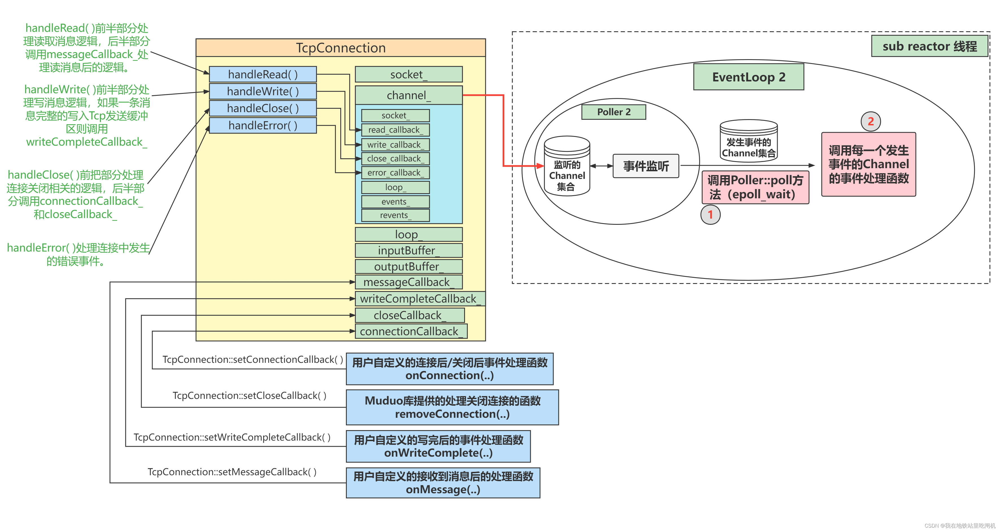

# 消息读取逻辑

## TcpConnection

```C++
class TcpConnection : noncopyable , public std::enable_shared_from_this<TcpConnection>
{
public:
    TcpConnection(EventLoop * loop,
                  const std::string & name,
                  int sockfd,
                  const InetAddress & localAdd,
                  const InetAddress & peerAddr);
    ~TcpConnection();
private:
    EventLoop * m_loop;  // sub_loop
    const std::string m_name;
    std::atomic_int m_state;
    bool m_reading;

    std::unique_ptr<muduoSocket> m_socket;
    std::unique_ptr<Channel> m_channel;

    const InetAddress m_localAddr; // 当前主机地址
    const InetAddress m_peerAddr; // 对端地址

    ConnectionCallBack m_connectionCallBack;
    MsgCallback m_msgCallBack;
    WriteCompleteCallBack m_writeCompleteCallBack;
    CloseCallBack m_closeCallBack;
    HighWaterMarkCallback m_highWaterMarkCallBack;

    size_t m_highWaterMark;
    Buffer m_inputBuffer; // 接收缓冲区
    Buffer m_outputBuffer; // 发送缓冲区
};
```



在 main_loop 中接受新连接请求之后，将这条Tcp连接封装成TcpConnection对象。TcpConnection对象的内容如上图所示

在 TcpConnection 的构造函数中会将TcpConnection::handleRead( )等四个上图中的蓝色方法注册进这个 channel_ 内。

当TcpConnection对象建立完毕之后，main_loop 的 Acceptor 会将这个 TcpConnection 对象中的channel_注册到某一个 sub_loop 中。

## sub_loop 的事件循环

```C++
// eventLoop.cc
void EventLoop::loop()
{
    m_looping = true;
    m_quit = false;
    while (!m_quit)
    {
        m_channelList.clear();
        // main_loop 监听的是 acceptorfd, sub_loop监听的是clientfd
        m_pollReturnTime = m_poller->poll(kPollTimeMs, &m_channelList);
        for (Channel * channel : m_channelList) // 依次调用每个channel的handleEvent( )
        {
            m_currentActiveChannel = channel;
            m_currentActiveChannel->handelEvent(m_pollReturnTime);
        }
        m_currentActiveChannel = nullptr;
        /**
         * 执行当前Eventloop需要处理的回调操作
         * main_loop --> 只做 accept用，返回 fd --> 打包为channel --> 给sub_loop
         * main_loop 事先注册一个回调(sub_loop使用) sub_loop被唤醒之后执行
        */
        doPendingFunctors();
    }

    m_looping = false;
}

```


如上图所示，SubEventLoop中的EventLoop::loop()函数内部会循环的执行上图中的步骤1和步骤2。

步骤1就是调用Poller::poll()方法获取事件监听结果，这个事件监听结果是一个Channel集合，每一个Channel封装着 [一个fd] 及 [fd感兴趣的事件] 和 [事件监听器监听到该fd实际发生的事件]。

步骤2就是调用每一个 Channel 的 **Channel::HandlerEvent()** 方法。该方法会根据每一个Channel的感兴趣事件以及实际发生的事件调用提前注册在Channel内的对应的事件处理函数(readCallback_、writeCallback_、closeCallback_、errorCallback_)。readCallback_保存的函数其实是TcpConnection::handleRead( )，消息读取的处理逻辑也就是由这个函数提供的：

```C++
void TcpConnection::handleRead(Timestamp receiveTime)
{
    int saveErrno = 0;
    ssize_t n = m_inputBuffer.readFd(m_channel->fd(), &saveErrno);

    // 当readFd( )返回值大于0，说明从接收缓冲区中读取到了数据，
    // 那么会接着调用m_messageCallback中保存的用户自定义的读取消息后的处理函数。
    if (n > 0)
    {
        m_msgCallBack(shared_from_this(), &m_inputBuffer, receiveTime);
    }
    else if (n == 0) // 说明客户端连接关闭，这时候应该调用TcpConnection::handleClose()来处理连接关闭事件
    {
        handleClose();
    }
    else // readFd( )返回值等于-1，说明发生了错误，调用TcpConnection::handleError( )来处理savedErrno的错误事件。
    {
        errno = saveErrno;
        handleError();
    }
}
```

Moduo库只支持LT模式，所以读事件不会出现EAGAIN的错误，所以一旦出现错误，说明肯定是比较不好的非正常错误了。而EAGAIN错误只不过是非阻塞IO调用时的一种常见错误而已。

**Buffer::readFd()** :

这个 readFd 巧妙的设计，可以让用户一次性把所有TCP接收缓冲区的所有数据全部都读出来并放到 **m_inputBuffer** 中。

Buffer是有大小限制的，我们一开始不知道TCP接收缓冲区中的数据量有多少，如果一次性读出来会不会导致Buffer装不下而溢出。所以在readFd( )函数中会在栈上创建一个临时空间 **extrabuf**，然后使用 **readv** 的分散读特性，将TCP缓冲区中的数据先拷贝到 Buffer 中，如果 Buffer 容量不够，就把剩余的数据都拷贝到 extrabuf 中，**然后再调整 Buffer 的容量(动态扩容)，再把extrabuf的数据拷贝到Buffer中**。当这个函数结束后，extrabuf也会被释放。另外extrabuf是在栈上开辟的空间，速度比在堆上开辟还要快

```C++
/**
 * poller工作在 LT 模式，只要fd上有数据可读就会一直上报
 * buffer是大小有限制的，但从fd上读数据时，并不知道tcp最终会发送多少数据
*/
ssize_t Buffer::readFd(int fd, int * saveErrno)
{
    // 开辟一个栈上空间 64k
    char extrabuf[65536] = {0};
    // readv, writev 两个函数可以读写多个非连续缓冲区，缓冲区信息存在 iovec 参数中
    struct iovec vec[2];
    // buffer缓冲区剩余空间大小，不一定可以存下读出来的数据
    const size_t writable = writableBytes();

    // buffer 与新开辟的 extrabuf 一起读取，数据顺序填充 vec
    vec[0].iov_base = begin() + m_writeIndex;
    vec[0].iov_len = writable;
    vec[1].iov_base = extrabuf;
    vec[1].iov_len = sizeof extrabuf;

    // when there is enough space in this buffer, don't read into extrabuf.
    // when extrabuf is used, we read 128k-1 bytes at most.
    const int iovcnt = (writable < sizeof extrabuf) ? 2 : 1;
    const ssize_t n = ::readv(fd, vec, iovcnt);
    if (n < 0)
    {
        *saveErrno = errno;
    }
    else if (n <= writable)
    {
        m_writeIndex += n;
    }
    else
    {
        m_writeIndex = m_buffer.size();
        append(extrabuf, n - writable);
    }
    return n;
}
```

## 消息发送

当用户调用了 TcpConnetion::send(std::string msg) 函数时，相当于要求muduo库把数据发送给该Tcp连接的服务端。
此时该TcpConnection注册在事件监听器上的感兴趣事件中是没有可写事件的。

```C++
// tcpconnection.cc
// 发送数据
void TcpConnection::send(const std::string & msg)
{
    if (m_state == kConnected)
    {
        if (m_loop->isInLoopThread())
        {
            sendInLoop(msg.c_str(), msg.size());
        }
        else
        {
            m_loop->runInLoop(std::bind(&TcpConnection::sendInLoop,
                              this, msg.c_str(), msg.size()));
        }
    }
}

/**
 * @brief 发送数据的实现，先直接发，发不完就注册可写事件，排队处理
 *        应用只管写，内核发送的慢，设置有高水位线
*/
void TcpConnection::sendInLoop(const void * msg, size_t len)
{
    ssize_t nwrote = 0;
    size_t remaining = len;
    bool faultError = false;
    if (kDisconnected == m_state)
    {
        return;
    }

    // if no thing in output queue, try writing directly
    // 如果 m_outputBuffer.readableBytes() != 0 则表示上一次的数据还没发送完成
    if (!m_channel->isWriting() && m_outputBuffer.readableBytes() == 0)
    {
        nwrote = ::write(m_channel->fd(), msg, len);
        if (nwrote >= 0)
        {
            remaining = len - nwrote;
            if (remaining == 0 && m_writeCompleteCallBack)
            {   // 发完了, 用不上缓冲区，也就不用再往channel上注册epollout事件
                m_loop->queueInLoop(std::bind(m_writeCompleteCallBack, shared_from_this()));
            }
        }
        else // nwrote < 0 出错
        {
            nwrote = 0;
            // EWOULDBLOCK的意思是 由于非阻塞，没有返回
            if (errno != EWOULDBLOCK)
            {
                LOG_ERROR << "TcpConnection::sendInLoop";
                if (errno == EPIPE || errno == ECONNRESET)
                {   // 对端 SIGPIPE 或者 ECONNRESET
                    faultError = true;
                }
            }
        }
    }

    /**
     * 当前这次write系统调用并没有把数据全部发送出去
     * 剩余的数据保存在缓冲区，然后给channel注册 epollout 事件
     * poller发现tcp的发送缓冲区有空间时就会通知相应的channel调用 writeCallBack
     * 在tcpconnection中给channel注册的writeCallBack就是handleWrite
     * */ 
    if (!faultError && remaining > 0)
    {
        size_t oldLen = m_outputBuffer.readableBytes();
        // 高水位处理
        if (oldLen + remaining >= m_highWaterMark
            && oldLen < m_highWaterMark
            && m_highWaterMarkCallBack)
        {
            m_loop->queueInLoop(std::bind(m_highWaterMarkCallBack,
                                          shared_from_this(),
                                          oldLen + remaining)); 
        }

        m_outputBuffer.append(static_cast<const char*>(msg) + nwrote, remaining);
        if (!m_channel->isWriting())
        {   // 注册可写事件
            m_channel->enableWriting();
        }
    }
}
```

如果TCP发送缓冲区能一次性容纳buf，那这个write( )函数将buf全部拷贝到发送缓冲区中。

如果TCP发送缓冲区内不能一次性容纳buf：

- 事件监听器监听到该Tcp连接可写事件，就会调用TcpConnection::handleWrite( )函数把TcpConnection::m_outputBuffer中剩余的数据发送出去。
- 在TcpConnection::handleWrite( )函数中，通过调用Buffer::writeFd()函数将m_outputBuffer的数据写入到Tcp发送缓冲区，如果Tcp发送缓冲区能容纳全部剩余的未发送数据，那最好不过了。如果Tcp发送缓冲区依旧没法容纳剩余的未发送数据，那就尽可能地将数据拷贝到Tcp发送缓冲区中，继续保持可写事件的监听。
- 当数据全部拷贝到Tcp发送缓冲区之后，就会调用用户自定义的 writeCompleteCallback ，并且移除该TcpConnection在事件监听器上的可写事件。（移除可写事件是为了提高效率，不会让epoll_wait() 毫无意义的频繁触发可写事件。因为大多数时候是没有数据需要发送的，频繁触发可写事件但又没有数据可写。）
