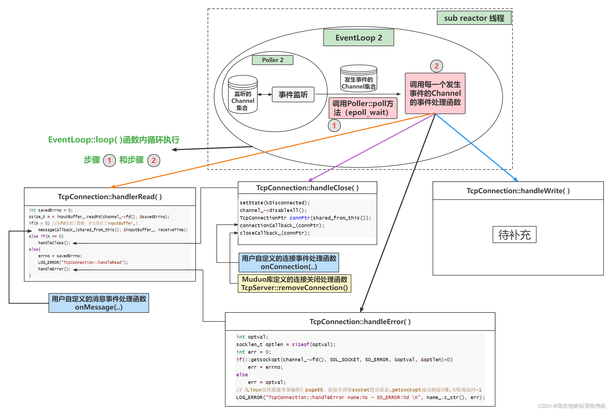

### 消息读取


在MainEventLoop中接受新连接请求之后，将这条Tcp连接封装成TcpConnection对象。TcpConnection对象的内容如上图所示，主要就是封装了连接套接字的fd(上图中的socket_)、连接套接字的channel_等。

在TcpConnection的构造函数中会将TcpConnection::handleRead( )等四个上图中的蓝色方法注册进这个channel_内。

当TcpConnection对象建立完毕之后，MainEventLoop的Acceptor会将这个TcpConnection对象中的channel_注册到某一个SubEventLoop中。

#### 消息读取逻辑


如上图所示，SubEventLoop中的EventLoop::loop()函数内部会循环的执行上图中的步骤1和步骤2。

步骤1就是调用Poller::poll()方法获取事件监听结果，这个事件监听结果是一个Channel集合，每一个Channel封装着 [一个fd] 及 [fd感兴趣的事件] 和 [事件监听器监听到该fd实际发生的事件]。

步骤2就是调用每一个Channel的Channel::HandlerEvent方法。该方法会根据每一个Channel的感兴趣事件以及实际发生的事件调用提前注册在Channel内的对应的事件处理函数(readCallback_、writeCallback_、closeCallback_、errorCallback_)。readCallback_保存的函数其实是TcpConnection::handleRead( )，消息读取的处理逻辑也就是由这个函数提供的，我们稍微剖析一下这个函数：
```C++
void TcpConnection::handleRead(Timestamp receiveTime)
{
    int saveErrno = 0;
    ssize_t n = m_inputBuffer.readFd(m_channel->fd(), &saveErrno);
    /**
     * 当readFd( )返回值大于0，
     * 说明从接收缓冲区中读取到了数据，
     * 那么会接着调用m_messageCallback
     * 中保存的用户自定义的读取消息后的处理函数。
    */
    if (n > 0)
    {
        m_msgCallBack(shared_from_this(), &m_inputBuffer, receiveTime);
    }
    /**
     * readFd( )返回值等于0，说明客户端连接关闭，
     * 这时候应该调用TcpConnection::handleClose( )
     * 来处理连接关闭事件
    */
    else if (n == 0)    // client 断开
    {
        handleClose();
    }
    /**
     * readFd( )返回值等于-1，说明发生了错误，
     * 调用TcpConnection::handleError( )
     * 来处理savedErrno的错误事件。
    */
    else
    {
        errno = saveErrno;
        handleError();
    }
}
```

Moduo库只支持LT模式，所以读事件不会出现EAGAIN的错误，所以一旦出现错误，说明肯定是比较不好的非正常错误了。而EAGAIN错误只不过是非阻塞IO调用时的一种常见错误而已。

Buffer::readFd : 
这个readFd巧妙的设计，可以让用户一次性把所有TCP接收缓冲区的所有数据全部都读出来并放到m_inputBuffer中。

Buffer是有大小限制的，我们一开始不知道TCP接收缓冲区中的数据量有多少，如果一次性读出来会不会导致Buffer装不下而溢出。所以在readFd( )函数中会在栈上创建一个临时空间extrabuf，然后使用readv的分散读特性，将TCP缓冲区中的数据先拷贝到Buffer中，如果Buffer容量不够，就把剩余的数据都拷贝到extrabuf中，然后再调整Buffer的容量(动态扩容)，再把extrabuf的数据拷贝到Buffer中。当这个函数结束后，extrabuf也会被释放。另外extrabuf是在栈上开辟的空间，速度比在堆上开辟还要快

```C++
/**
 * poller工作在 LT 模式，只要fd上有数据可读就会一直上报
 * buffer是大小有限制的，但从fd上读数据时，并不知道tcp最终会发送多少数据
*/
ssize_t Buffer::readFd(int fd, int * saveErrno)
{
    // 开辟一个栈上空间 64k
    char extrabuf[65536] = {0};
    // readv, writev 两个函数可以读写多个非连续缓冲区，缓冲区信息存在 iovec 参数中
    struct iovec vec[2];
    // buffer缓冲区剩余空间大小，不一定可以存下读出来的数据
    const size_t writable = writableBytes();

    // buffer 与新开辟的 extrabuf 一起读取，数据顺序填充 vec
    vec[0].iov_base = begin() + m_writeIndex;
    vec[0].iov_len = writable;
    vec[1].iov_base = extrabuf;
    vec[1].iov_len = sizeof extrabuf;

    // when there is enough space in this buffer, don't read into extrabuf.
    // when extrabuf is used, we read 128k-1 bytes at most.
    const int iovcnt = (writable < sizeof extrabuf) ? 2 : 1;
    const ssize_t n = ::readv(fd, vec, iovcnt);
    if (n < 0)
    {
        *saveErrno = errno;
    }
    else if (n <= writable)
    {
        m_writeIndex += n;
    }
    else
    {
        m_writeIndex = m_buffer.size();
        append(extrabuf, n - writable);
    }
    return n;
}
```

### 消息发送

当用户调用了TcpConnetion::send(buf)函数时，相当于要求muduo库把数据buf发送给该Tcp连接的客户端。此时该TcpConnection注册在事件监听器上的感兴趣事件中是没有可写事件的。TcpConnection::send(buf)函数内部其实是调用了Linux的函数write( )

如果TCP发送缓冲区能一次性容纳buf，那这个write( )函数将buf全部拷贝到发送缓冲区中。

如果TCP发送缓冲区内不能一次性容纳buf：
- 1. 这时候write( )函数buf数据尽可能地拷贝到TCP发送缓冲区中，并且将errno设置为EWOULDBLOCK。
- 2. 剩余未拷贝到TCP发送缓冲区中的buf数据会被存放在TcpConnection::m_outputBuffer中。并且向事件监听器上注册该TcpConnection::m_channel的可写事件。
- 3. 事件监听器监听到该Tcp连接可写事件，就会调用TcpConnection::handleWrite( )函数把TcpConnection::m_outputBuffer中剩余的数据发送出去。
- 4. 在TcpConnection::handleWrite( )函数中，通过调用Buffer::writeFd()函数将m_outputBuffer的数据写入到Tcp发送缓冲区，如果Tcp发送缓冲区能容纳全部剩余的未发送数据，那最好不过了。如果Tcp发送缓冲区依旧没法容纳剩余的未发送数据，那就尽可能地将数据拷贝到Tcp发送缓冲区中，继续保持可写事件的监听。
- 5. 当数据全部拷贝到Tcp发送缓冲区之后，就会调用用户自定义的【写完后的事件处理函数】，并且移除该TcpConnection在事件监听器上的可写事件。（移除可写事件是为了提高效率，不会让epoll_wait() 毫无意义的频繁触发可写事件。因为大多数时候是没有数据需要发送的，频繁触发可写事件但又没有数据可写。）

